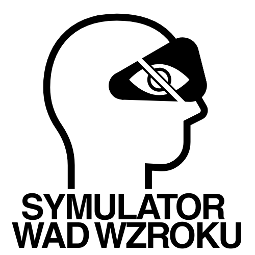
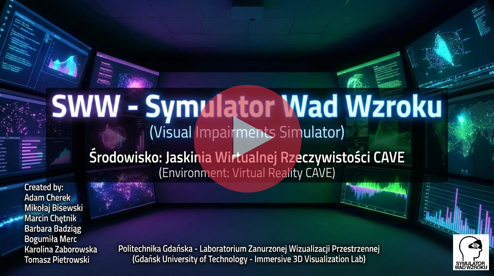

# PG Research Project 2025 - SWW
## Symulator Wad Wzroku (Visual Impairments Simulator)

*Advancing accessibility research through immersive virtual reality simulation*

---

## Quick Access

- [🔍 Project Overview](#-project-overview)
- [🏛️ Institution](#-institution)
- [👥 Team](#-team)
- [ℹ️ About Project](#ℹ️-about-project)
  - [🎯 Main Goal](#-main-goal)
  - [🔧 System Design](#-system-design)
    - [Simulator Architecture](#simulator-architecture)
    - [Visual Rendering Pipeline - Shaders](#visual-rendering-pipeline---shaders)
    - [External Controller](#external-controller---sww-controller-application)
    - [Custom Unity Editor Tools](#custom-unity-editor-tools)
  - [🚀 How It Works](#-how-it-works)
    - [Virtual Environment](#virtual-environment)
    - [User Interaction Model](#user-interaction-model)
    - [Task Scenarios](#task-scenarios)
    - [Documentation & Technical References](#documentation--technical-references)
  - [📊 Research & Evaluation](#-research--evaluation)
  - [📚 Results & Documentation](#-results--documentation)
- [📄 License](#-license)
- [🙏 Acknowledgments](#-acknowledgments)
- [Results Repository →](../results/README.md)

## 🔍 Project Overview

**SWW (Symulator Wad Wzroku)** is an immersive virtual reality simulator designed to enable healthy individuals to experience visual perception from the perspective of people with various visual impairments and eye diseases. Developed in the Immersive 3D Visualization Lab (LZWP) at Gdańsk University of Technology, this educational and research tool supports architects, designers, and students in understanding accessibility from the user's viewpoint through direct immersive experience.

The simulator uses a symptom-based approach rather than clinical diagnosis modeling, allowing flexible combination and real-time adjustment of 22 distinct visual impairments. Users interact with realistic, everyday scenarios (meal preparation, hygiene activities, device operation) within a digitally modeled single-family house, providing meaningful context for evaluating how visual limitations impact daily functioning and spatial navigation.

## 🏛️ Institution

**Politechnika Gdańska (Gdansk University of Technology)**
- Faculty of Electronics, Telecommunications and Informatics
- Department of Intelligent Interactive Systems
- [Immersive 3D Visualization Lab (LZWP)](https://eti.pg.edu.pl/en/lzwp-en)

## 👥 Team

**Supervisor**: dr inż. Jacek Lebiedź

**Research Team**:
- [Adam Cherek](https://github.com/adbreeker)
- [Mikołaj Bisewski](https://github.com/Biz02m)
- [Karolina Zaborowska](https://github.com/karazab)
- [Barbara Badziąg](https://github.com/BasiaBa)
- [Marcin Chętnik](https://github.com/skipdudes)
- [Bogumiła Merc](https://github.com/sugoob)
- [Tomasz Pietrowski](https://github.com/tomaszpietr)

## ℹ️ About Project

### 🎯 Main Goal

The primary objective is to develop an accessible educational and research tool that enables individuals without visual impairments to experience spatial perception through the lens of various visual disorders. The simulator supports inclusive design education by allowing architects, urban planners, and designers to evaluate the accessibility of their designs from the end-user's perspective within an immersive virtual reality environment.

**Key motivation**: Unlike traditional clinical diagnosis-based models, this project adopts a symptom-based approach, recognizing that many visual conditions produce overlapping perceptual effects. This allows for realistic representation of a spectrum of visual experiences through flexible combination and intensity adjustment of individual symptoms.

---

### 🔧 System Design

#### Simulator Architecture

The simulator operates exclusively within the **BigCAVE environment** (3.4m × 3.4m) at the Immersive 3D Visualization Lab (LZWP). Key architectural components include:

**Core Modules:**
- **GameManager**: Manages simulation logic and command processing
- **VisualImpairmentsManager**: Handles all visual impairment effects and symptom combinations
- **SoundManager**: Controls audio playback and environmental soundscapes
- **SocketManager**: Manages network communication between simulator and external controller
- **LZWPlib Package**: Integrates CAVE-specific features (stereoscopic rendering, head tracking, camera systems)

**Environment Structure:**
- 7 total scenes: Main (default), Setup (fallback), Intro (tutorial lobby), and 4 user-facing room scenarios
- Room layouts: Hall (central hub), Bedroom, Bathroom, Kitchen - arranged in inverted "T" configuration
- All environments built to match CAVE physical dimensions (3.4m × 3.4m)
- Rich interactive elements (exceeding basic task requirements) to enhance immersion

#### Visual Rendering Pipeline - Shaders

The visual impairment simulation leverages **custom shaders and real-time post-processing techniques** to generate perceptually accurate effects. This shader-based implementation employs a dual-layer rendering architecture:

**Rendering Systems:**

1. **Camera Renderer** (Post-processing Filters):
   - Filters applied sequentially on top of the camera view
   - Each effect builds on the previous one, creating cumulative visual distortions
   - 17 distinct shader effects: Bloom, BlurVision, CameraShake, ColorBlind_Deutera, ColorBlind_Protanc, ColorBlind_Tritanor, DepthBlur, Desaturation, Distortion, Dizziness, DoubleVision, Farsighted, FoggyVision, Halo, LineDistortion, NightVision, Shortsighted
   - Ideal for global visual distortions affecting the entire visual field

2. **Sphere Renderer** (Spatial Effects):
   - Materials applied to a transparent sphere positioned close around the player's head
   - Enables superior visualization of spatial impairments with depth and proximity awareness
   - 5 shader effects (including legacy variants): DarkSpot, Floaters, RadialVignette, (Legacy)BlindSpots, (Legacy)Floaters
   - Provides realistic 3D spatial mapping for field-of-view restrictions and peripheral phenomena

**Key Capabilities:**
- **Real-time performance**: Smooth, responsive visual effects without noticeable latency
- **Dynamic parameter control**: All shaders expose an `_EffectStrength` variable (0.0-1.0) allowing real-time intensity adjustment via the controller application
- **Symptom combinations**: Simultaneous rendering of multiple shaders with independent parameter control
- **Spatial accuracy**: Sphere rendering ensures proper depth relationships for spatial impairments

**Predefined Visual Impairment Presets (8 total):**
The controller application includes 8 quick-access preset configurations combining multiple shader effects:
- Choroba Bensona (Benson's disease)
- Jaskra (Glaucoma)
- Kurza ślepota (Night blindness)
- Oczopląs (Nystagmus)
- Odwarstwienie siatkówki (Retinal detachment)
- Retinopatia cukrzycowa (Diabetic retinopathy)
- Zaćma (Cataract)
- Zwyrodnienie plamki żółtej (Age-Related Macular Degeneration)

Users can also create custom symptom combinations by independently adjusting individual shader parameters in real-time.

#### External Controller - SWW-Controller Application

A dedicated operator application providing seamless control over simulation parameters:

- **Real-time network interface**: Communicates with simulator via local network (UDP broadcast for discovery, TCP for data)
- **Operator UI**: Allows parameter management without disrupting user immersion within the CAVE
- **Network Configuration**: IP address management, broadcast/communication port settings
- **Visual Impairment Presets**: Quick-access saved configurations for common visual disorders
- **Stopwatch & Progress Tracking**: Monitors task execution time and user performance
- **Dev Console**: Command-line interface for advanced testing and debugging

#### Custom Unity Editor Tools

Specialized development tools integrated into the Unity editor workflow:

- **DevUI_EditorWindow**: Developer interface for in-editor testing and parameter visualization
- **DevVariablesManager**: Centralized management of development variables and configuration settings
- **SceneCollectionEditorSO**: Scene collection editing tool for managing room arrangement and loading workflows
- **SWW_MenuSection**: Custom menu integration for quick access to project-specific functions
- **PlaymodeRedirect**: Automation tool for redirecting playmode sessions to correct scenes
- **AssetRotationFixer**: Utility for correcting asset orientations during development

These tools streamline development workflows and reduce iteration time during system refinement.

---

### 🚀 How It Works

#### Virtual Environment

The simulator recreates a realistic single-family house interior at **1:1 scale** within the physical CAVE environment:

**Room Layouts:**
- **Hall**: Central entry point and connector between rooms; features illusory space elements to optically enlarge the environment
- **Kitchen**: Maximum movement space for exploratory tasks; includes refrigerator, stove, cabinets, workspace
- **Bathroom**: Balanced movement/static areas; equipped with standard fixtures (sink, mirror, toilet, shower, storage)
- **Bedroom**: Minimal movement space for static-focused tasks; furnished with bed, wardrobe, TV, bedside lighting

All rooms include interactive lighting systems (ceiling lamps, natural light simulation) and numerous interactive objects exceeding basic task requirements to maximize immersion.

#### User Interaction Model

**Physical Navigation:**
- Users physically move within the tracking area (3.4m × 3.4m)
- Head position and orientation tracked in real-time via stereoscopic glasses equipped with motion markers
- Dynamic perspective adjustment ensures visual coherence with physical movement

**Controller Interface (Flystick):**
- **Object Detection**: Automatically detects and highlights objects one at a time, prioritizing those directly targeted by a raycast, followed by those within a sphere overlap near the handle
- **Primary Button (Fire)**: Object pickup/drop, door interaction, scene transitions, primary actions
- **Secondary Button (Button 1)**: Contextual interactions (e.g., remote control button presses while holding the remote)
- **Interface Toggle (Button 4)**: Enables/disables virtual aiming ray for precise object targeting

**Interaction Types:**
- **Clickable Objects**: Single-action interactions (door transitions, cabinet opening)
- **Holdable Objects**: Objects that remain in user's hand (remote control, soap, food items)
- **Grabbable Objects**: Objects usable while held (secondary interactions like remote control buttons)

#### Task Scenarios

Users execute simple, realistic daily-living tasks:

1. **Bathroom - Personal Hygiene**: Hand washing task involving color discrimination (selecting correct soap), faucet operation, and simulated water interaction
2. **Kitchen - Meal Preparation**: Sandwich assembly requiring ingredient identification, spatial search, and proper sequencing
3. **Bedroom - Device Operation**: Television remote control task testing object location in varied lighting, device manipulation, and interface navigation

A diegetic (in-world) notepad tracks task progress with automatic checkmark updates and bold highlighting of current objectives.

#### Documentation & Technical References

Comprehensive technical documentation available in repository:

- **[Technical Documentation](../results/README.md#-technical-documentation)** (PG_WETI_DT_wer1.2.pdf): System architecture, implementation details, installation procedures, controller configuration
- **[System Project Specification](../results/README.md#-system-project-specification)** (PG_WETI_PS_wer1.0.pdf): Functional/non-functional requirements, detailed system design, component interactions
- **[Research Article](../results/README.md#-research-article)** (ARTICLE.pdf): Academic publication with methodology, literature review, and research findings

**See also presentation on YouTube:** 

---

### 📊 Research & Evaluation

#### Research Objectives

The project conducted comprehensive research to evaluate:

1. **Effectiveness**: Validity of symptom-based visual impairment simulation in recreating realistic perceptual experiences
2. **Usability**: Accessibility and intuitiveness of the interface for users without prior VR experience
3. **Educational Impact**: Value as an accessibility education tool for architectural and design students
4. **Spatial Cognition**: Effects of combined visual impairments on navigation, object search, and task completion time

#### Methodology

Research employed quantitative and qualitative evaluation:
- **Pilot testing**: Iterative system refinement based on user feedback
- **Task performance metrics**: Completion time, accuracy, movement patterns analysis
- **Symptom validation**: Verification of simulated visual effects against clinical descriptions
- **User experience assessment**: Comfort, immersion, interface intuitiveness

#### Research Gap Addressed

While extensive VR-based visual impairment research exists using Head-Mounted Displays (HMDs), there is a notable absence of solutions specifically targeting **CAVE environments**. This project fills that gap by:
- Adapting immersive experiences to large-scale shared projection systems
- Enabling group observation (operator + participant) for educational scenarios
- Providing higher spatial fidelity through 1:1 scale virtual-to-physical environment mapping

---

### 📚 Results & Documentation

#### Research Outcomes

The project resulted in a fully functional educational simulator with extensive validation. Key deliverables include:

**Simulation Engine:**
- 22 distinct visual impairment implementations
- Real-time shader-based rendering system
- Network-controlled parameter management
- Intuitive user interface requiring no VR experience
- Compatible with CAVE environment infrastructure

**Research Documentation:**
The project timeline (March 2025 - February 2026) produced a comprehensive research corpus as part of the complete SWW research initiative:

- **[Research Article](../results/README.md#-research-article)** - Peer-reviewed publication documenting methodology, results, and implications
- **[Analysis of Research Results](../results/README.md#--analysis-of-research-findings)** - Detailed findings from user testing and system validation
- **[Technical Documentation](../results/README.md#-technical-documentation)** - Complete system implementation reference
- **[System Project Specification](../results/README.md#-system-project-specification)** - Detailed requirements and design specifications
- **[Project Poster](../results/README.md#-project-poster)** - Bilingual (Polish/English) research summary for academic dissemination

**Full documentation available at:** [Results Repository](../results/README.md)

#### Key Findings

- Visual impairments significantly impact task completion time and navigation efficiency
- Symptom-based approach provides flexible, clinically accurate representation of real-world visual experiences
- CAVE-based immersion enables superior spatial understanding compared to HMD-based approaches
- Simple, intuitive interface design ensures accessibility for non-technical users
- System effectiveness validated through pilot user studies and iterative refinement

#### Future Research Directions

- Extended user studies with professional architects and designers
- Data analysis and results compilation
- Article publication and academic dissemination

## 📄 License

**Property of Politechnika Gdańska (Gdansk University of Technology) and the reseach team.**

This is a **closed-source** research project. The code and assets are proprietary.
Access to the source code, binaries, or use of the simulator requires explicit permission and contact with the university representatives.

## 🙏 Acknowledgments

- **Politechnika Gdańska** for providing research facilities
- **LZWP Team** for guidance and great atmosphere 

---

**Made with ❤️ by the SWW Team 2025**

*Advancing accessibility through innovation*

