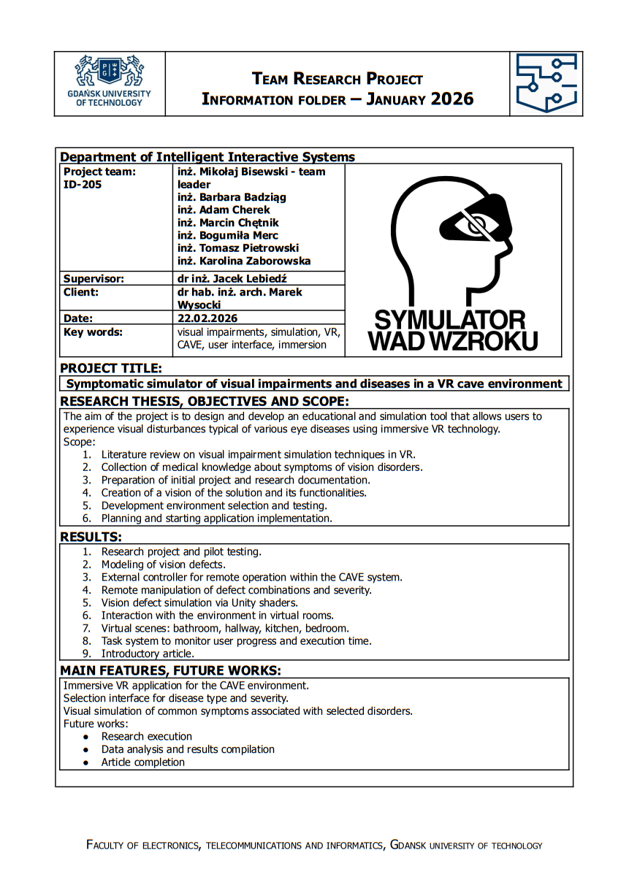

# Project Results & Documentation

This directory contains project documentation, technical specifications, research analysis, and dissemination materials.

## 🌟 Research Article

**File:** [ARTICLE.pdf](./ARTICLE.pdf)  
A comprehensive research article documenting the project outcomes and findings for academic publication.

---

## Some Project Documents

### 📊 Analysis of Research Results
**File:** [PG_WETI_AWB_wer.1.5.pdf](./PG_WETI_AWB_wer.1.5.pdf)  
**Language:** Polish  
**Description:** Comprehensive analysis of research findings and experimental results from the project. This document details the methodology, data analysis, and conclusions drawn from the research phase.

### 🔧 Technical Documentation  
**File:** [PG_WETI_DT_wer1.2.pdf](./PG_WETI_DT_wer1.2.pdf)  
**Language:** Polish  
**Description:** Complete technical documentation covering system architecture, implementation details, configurations, and operational guidelines for maintaining and extending the project.

### 📋 System Project Specification
**File:** [PG_WETI_PS_wer1.0.pdf](./PG_WETI_PS_wer1.0.pdf)  
**Language:** Polish  
**Description:** Detailed system project specification outlining functional and non-functional requirements, system design, components, and interfaces.

### 🎨 Project Poster
**File:** [PG_WETI_Plakat_II.pdf](./PG_WETI_Plakat_II.pdf)  
**Languages:** Polish & English  
**Description:** Project poster summarizing key aspects of the work in both Polish and English, suitable for presentations and conferences.

---

## Project Poster

